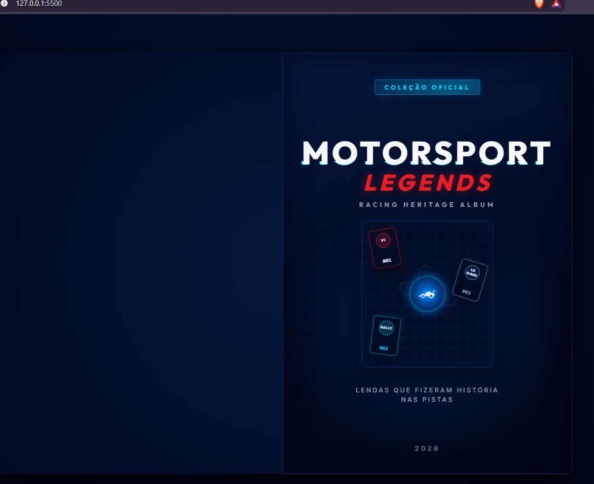
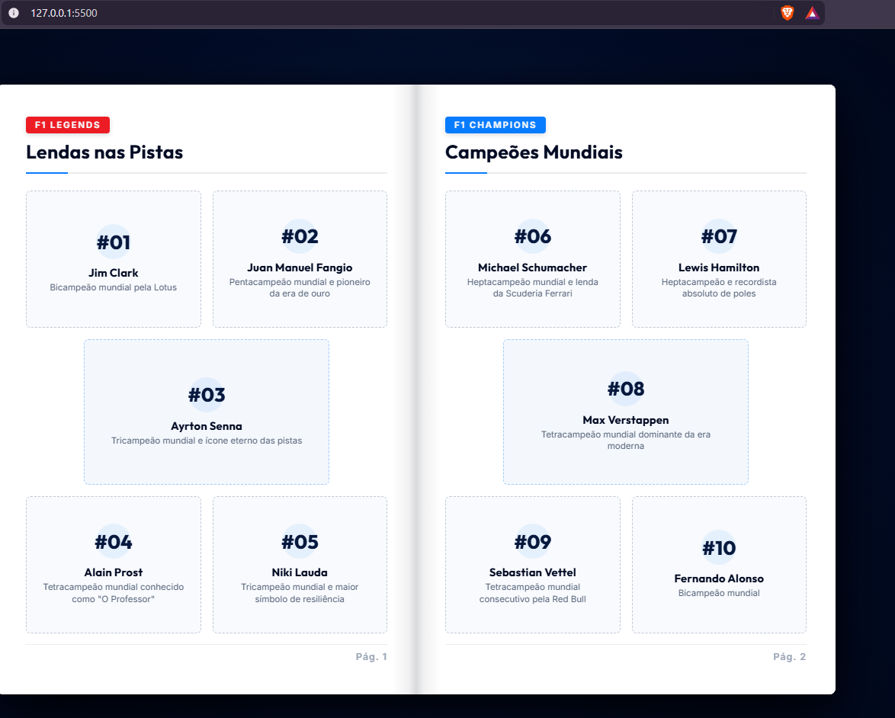
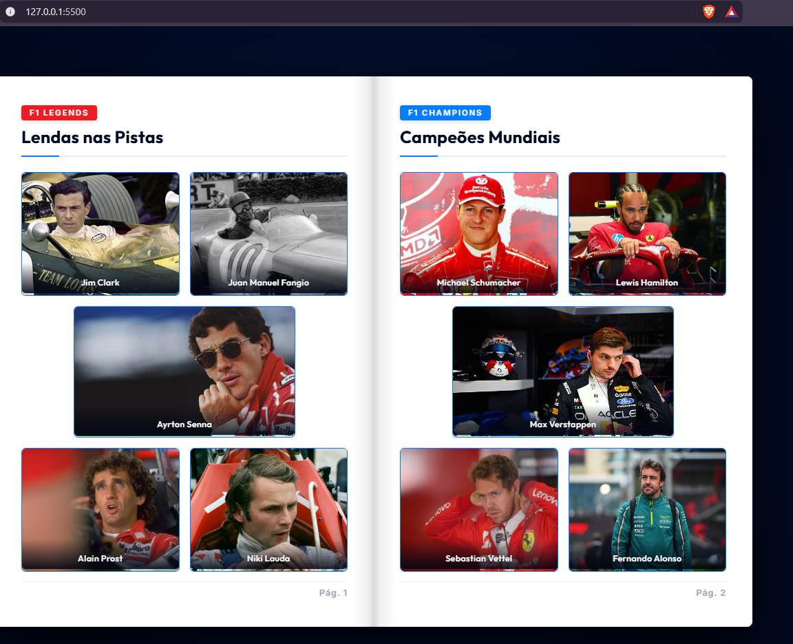

# Motorsport Collection

Projeto de álbum digital interativo inspirado no universo do automobilismo. A ideia é criar uma coleção de figurinhas com pilotos, equipes, carros e momentos marcantes da categoria, combinando frontend web, API REST e nostalgia.

## Objetivo

Praticar a integração entre:

- frontend em navegador;
- API REST em Python com FastAPI;
- arquivos estáticos e imagens locais;
- consumo de dados em JavaScript para montar um álbum interativo.

## Tema do projeto

Este álbum é dedicado ao automobilismo, com figurinhas de:

- pilotos lendários;
- equipes e marcas;
- carros icônicos;
- momentos históricos da categoria.

## Funcionalidades

- Álbum com páginas interativas;
- Carregamento de figurinhas via API;
- Exibição de imagens por identificador;
- Navegação entre páginas do álbum;
- Estrutura pronta para ampliar a coleção com novos itens.

## Screenshots

<div align="center">
  <table>
    <tr>
      <td align="center">
        
        <br />
        <em>Capa do álbum</em>
      </td>
      <td align="center">
        
        <br />
        <em>Página interna</em>
      </td>
    </tr>
    <tr>
      <td align="center" colspan="2">
        
        <br />
        <em>Detalhe da figurinha</em>
      </td>
    </tr>
  </table>
</div>

## Tecnologias

- Python
- FastAPI
- Uvicorn
- HTML
- CSS
- JavaScript
- PageFlip para efeito de virar páginas

## Estrutura do projeto

```text
├── backend/
│   ├── data/
│   │   └── figurinhas.py
│   ├── figurinhas/
│   ├── main.py
│   └── requirements.txt
├── frontend/
│   ├── app.js
│   ├── index.html
│   └── style.css
├── README.md
└── .gitignore
```

## API

### Endpoints

- `GET /figurinhas`  
  Retorna a lista de figurinhas disponíveis no álbum.

- `GET /figurinhas/{id}/imagem`  
  Retorna a imagem correspondente à figurinha informada.

Se a figurinha não existir ou não tiver imagem, a API responde com `404`.

## ▶ Como executar

### 1) Crie e ative o ambiente virtual

No PowerShell, na pasta raiz do projeto:

```powershell
python -m venv .venv
.\.venv\Scripts\Activate.ps1
```

### 2) Instale as dependências do backend

```powershell
cd backend
pip install -r requirements.txt
```

### 3) Inicie a API

```powershell
python -m uvicorn main:app --reload
```

A API ficará disponível em:

- `http://localhost:8000`

### 4) Inicie o frontend

Abra outro terminal e execute:

```powershell
cd frontend
python -m http.server 5500
```

Depois acesse:

- `http://localhost:5500`

## Observações

- O frontend busca os dados em `http://localhost:8000`.
- As imagens ficam armazenadas em `backend/figurinhas`.
- A biblioteca PageFlip é carregada via CDN, então o navegador precisa ter acesso à internet.

## Conclusão

Este projeto é uma prática de desenvolvimento web full-stack com tema de automobilismo, unindo backend, frontend e dados locais para criar uma experiência de álbum digital dinâmica.
